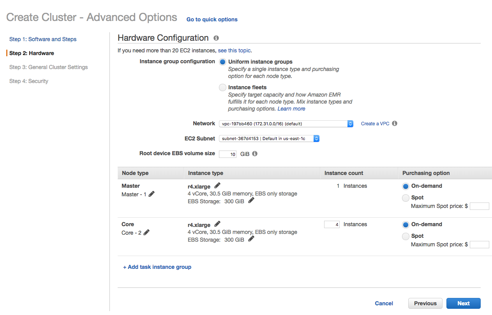
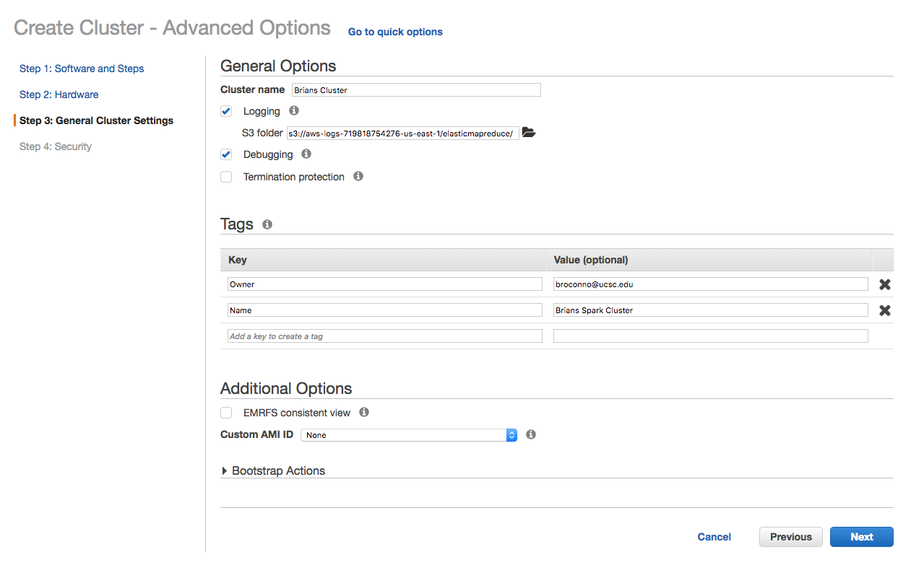
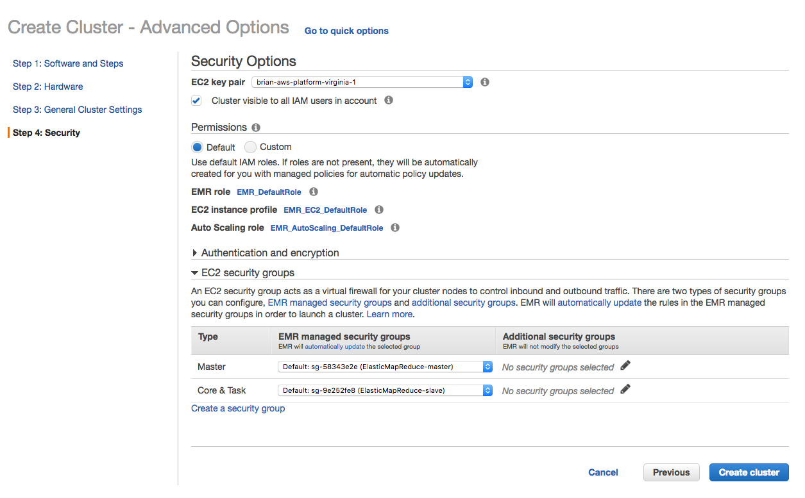
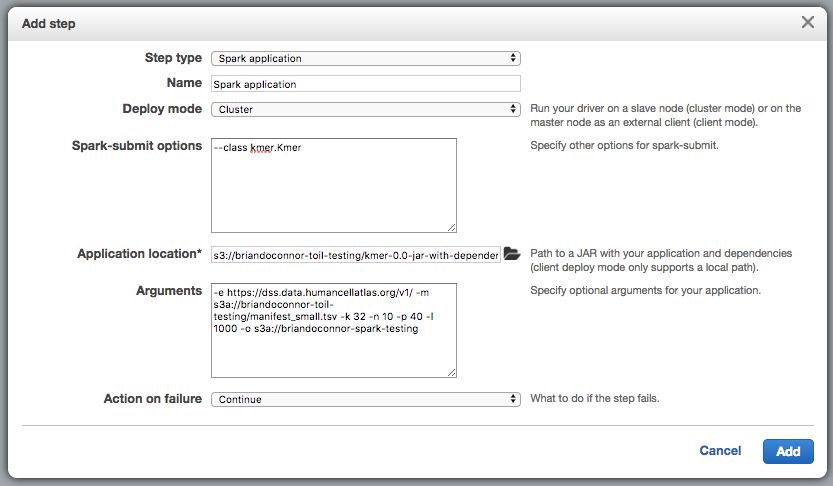

# SPARK Example

This is a simple application to find k-mers from fastq files hosted in the
[HCA Preview](https://preview.data.humancellatlas.org/) ["Blue Box"](https://github.com/HumanCellAtlas/data-store) aka
the cloud-based data storage system used by the project.  It is meant to
provide a concrete example of processing HCA data on the cloud using SPARK.
The k-mer code is actually from the excellent O'Reilly book *Data Algorithms,
Recipes for Scaling Up with Hadoop and Spark* by Mahmoud Parsian.  You
can find the code examples for this book [here](https://github.com/mahmoudparsian/data-algorithms-book).

The idea is this application can run in SPARK and scale out the generation
of k-mers and their aggregation/counting in a way that takes advantage of the
parallelization of a SPARK cluster.  Here I use EMR on AWS to setup a SPARK
cluster and control the fastq files I process using a simple manifest file.
The most frequent n k-mers are reported back along with the UUID of the
source fastq file they came from.

You can use this code as a starting point for your own exploration of the HCA
data.  Fork it and have fun!

# Running the Example

This tutorial assumes you have an AWS account and are familiar with that
cloud platform.

## Launch an EMR Cluster

The first step is to create a SPARK cluster via AWS's EMR.

I'm not going to give a full tutorial on how to launch an EMR cluster
but hopefully these screen shots will give you an idea of how to do this.

You will want to change the number of worker nodes, for example, on Step 2.
You will also want to tune the amount of space for EBS storage on each
as well.  Other settings, like the cluster name, EC2 key pair, etc will
be specific to your setup.






## Setup Inputs/Outputs

This program takes a manifest file for inputs and produces output text files in
an S3 bucket.

**NOTE:** You *must* delete the contents of the output S3 bucket before
you run this program.  It will fail if you try to overwrite.

### Inputs

The input is a simple manifest listing the UUIDs of the data bundles
from the HCA Data Store for the data bundles containing the fastq files
of interest.  For the preview, you can see these UUIDs in the download
scripts linked to from the [Preview Site]().  Here's an example:

```
76c2d255-9dc3-46da-998e-2226a18e5423
880f512e-ef83-47e1-9bc1-9bfd5e8ab4d9
a58bae43-9e8f-45e9-8ef0-38016c2fdfa2
d96f285e-1b84-4718-b4cc-f4a4dba15fc4
```

Put this in a path within one of your s3 buckets, I used `s3://briandoconnor-toil-testing/manifest_small.tsv` but you need
to put it in a location that works for you.  For testing you
can use the UUIDs above!

### Outputs

Create an S3 location where you want to output your results.  I used
`s3://briandoconnor-spark-testing` in my own testing but use a location
that works for you.

**NOTE:** You *must* delete the contents of the output S3 bucket before
you run this program.  It will fail if you try to overwrite.


## Local Dependencies

These directions assume you have Maven and Java 8 installed.
I'm working on a Mac so YMMV.

```
# Create your conda python environment:
conda create -n python_3_6_5_aws_cli python=3.6.5 anaconda

# use it
source activate python_3_6_5_aws_cli

# install the AWS CLI, make sure you setup you config in ~/.aws/credentials
pip install awscli --upgrade
```

## Compile

In the example below replace `s3://briandoconnor-toil-testing/` with
a location in your own S3 buckets and note the path of the output,
you'll need it later.

```
# compile the code
mvn clean install && aws s3 cp target/simple-project-1.0.jar s3://briandoconnor-toil-testing/

# same but I commit, push, and then compile the code
git commit -a -m updates; git push && mvn clean install && aws s3 cp target/simple-project-1.0.jar s3://briandoconnor-toil-testing/
```

## Running

Make sure your EMR cluster has finished provisioning and is ready
to go (the prep step should be finished).

You are going to need some parameters to launch this program:

```
# args
--class Kmer

# jar
s3://briandoconnor-toil-testing/simple-project-1.0.jar

# revised args, this will only process the first 1000 lines
s3a://briandoconnor-toil-testing/manifest_small.tsv 32 10 40 1000 s3a://briandoconnor-spark-testing
```

Here the arguments are:

1. the manifest of the UUIDs for input data bundles
1. the size of the k-mer, in this case 32 bases
1. the top N abundant k-mers to report back, in this case the top 10 abundant k-mer per fastq file
1. the number of partitions, typically 3 or 4 times the number of CPU cores in your cluster (here my cluster is using `r4.xlarge` nodes, so 4 worker nodes x 4 cores x 3 or 4 = 48 to 64... I used 40)
1. the number of sequences to process, here I'm just generating k-mers for the first 1000 reads per fastq file.  In Titus' blog post (see below) he used 1 million reads
1. finally, the output S3 location for the output

**NOTE:** you need to customize the jar path to wherever you copied it to
in the previous step.  You also need to customize `s3a://briandoconnor-toil-testing/manifest_small.tsv` to wherever you
host your manifest and `s3a://briandoconnor-spark-testing` to wherever you
want the output to go.

You can then launch the job through the EMR web interface, see the
"step" tab:



# Sample Output

This is a just a TSV file with the first column being the UUID for the
fastq file processed, the k-mer count, and the k-mer.  The top N k-mers are
listed (but the order is not preserved, you need to look at the count).

This is not super useful since you really expect a more useful ID like
biomaterial specimen ID for example.

The output can be split if you have generated a large number of k-mers.
Look for the `part-000x` files in the `top_kmers.tsv` directory in S3.

*With this test data and a 4 node cluster the run of the program should take
about 3 minutes. 8 minutes for 1M reads.*

```
03e63ba5-1818-42e4-a078-95d83104eb27	6	CAGAGTACTTTTTTTTTTTTTTTTTTTTTTTT
03e63ba5-1818-42e4-a078-95d83104eb27	4	CGCAGAGTACTTTTTTTTTTTTTTTTTTTTTT
03e63ba5-1818-42e4-a078-95d83104eb27	3	TAGGCACACGCTGAGCCAGTCAGTGTAGCGCG
03e63ba5-1818-42e4-a078-95d83104eb27	2	ATCAGTAGGGTAAAACTAACCTGTCTCACGAC
03e63ba5-1818-42e4-a078-95d83104eb27	1	ATTGTCAACAACGTCTGTGCAGGGCTAGTTGG
3df2bbe9-5530-4236-bb7c-be058749f179	44	CTTTTTTTTTTTTTTTTTTTTTTTTTTTTTTT
3df2bbe9-5530-4236-bb7c-be058749f179	43	GTACTTTTTTTTTTTTTTTTTTTTTTTTTTTT
3df2bbe9-5530-4236-bb7c-be058749f179	36	GAGTACTTTTTTTTTTTTTTTTTTTTTTTTTT
3df2bbe9-5530-4236-bb7c-be058749f179	34	CGCAGAGTACTTTTTTTTTTTTTTTTTTTTTT
3df2bbe9-5530-4236-bb7c-be058749f179	33	CAGAGTACTTTTTTTTTTTTTTTTTTTTTTTT
3df2bbe9-5530-4236-bb7c-be058749f179	14	TTTTTTTTTTTTTTTTTTTTTTTTTTTTTTTC
3df2bbe9-5530-4236-bb7c-be058749f179	13	TTTTTTTTTTTTTTTTTTTTTTTTTTTTTTTA
3df2bbe9-5530-4236-bb7c-be058749f179	12	GCCAGTAGCATATGCTTGTCTCAAAGATTAAG
3df2bbe9-5530-4236-bb7c-be058749f179	11	AGCATATGCTTGTCTCAAAGATTAAGCCATGC
3df2bbe9-5530-4236-bb7c-be058749f179	10	GATCCTGCCAGTAGCATATGCTTGTCTCAAAG
eace1ea5-d04d-4066-a069-09a50b4563fc	3	GATCCCCATCACGAATGGGGTTCAACGGGTTA
eace1ea5-d04d-4066-a069-09a50b4563fc	2	GGCGCACAGAGGCCACACTGAGGACATCATCA
eace1ea5-d04d-4066-a069-09a50b4563fc	1	AGGAGCGATCGGGCTGATGTTCCTGATGCTTG
d03e1fb5-0bd6-41ad-9744-c87af0fbdc33	114	GTACTTTTTTTTTTTTTTTTTTTTTTTTTTTT
d03e1fb5-0bd6-41ad-9744-c87af0fbdc33	104	CTTTTTTTTTTTTTTTTTTTTTTTTTTTTTTT
d03e1fb5-0bd6-41ad-9744-c87af0fbdc33	103	GAGTACTTTTTTTTTTTTTTTTTTTTTTTTTT
d03e1fb5-0bd6-41ad-9744-c87af0fbdc33	93	CAGAGTACTTTTTTTTTTTTTTTTTTTTTTTT
d03e1fb5-0bd6-41ad-9744-c87af0fbdc33	90	CGCAGAGTACTTTTTTTTTTTTTTTTTTTTTT
d03e1fb5-0bd6-41ad-9744-c87af0fbdc33	80	AACGCAGAGTACTTTTTTTTTTTTTTTTTTTT
d03e1fb5-0bd6-41ad-9744-c87af0fbdc33	76	ATCAACGCAGAGTACTTTTTTTTTTTTTTTTT
d03e1fb5-0bd6-41ad-9744-c87af0fbdc33	75	TATCAACGCAGAGTACTTTTTTTTTTTTTTTT
d03e1fb5-0bd6-41ad-9744-c87af0fbdc33	64	TTTTTTTTTTTTTTTTTTTTTTTTTTTTTTTC
d03e1fb5-0bd6-41ad-9744-c87af0fbdc33	40	TTTTTTTTTTTTTTTTTTTTTTTTTTTTTTCT
0d89a3df-c13e-4817-9bda-91205f4b5d53	27	TTTTTTTTTTTTTTTTTTTTTTTTTTTTTTTT
0d89a3df-c13e-4817-9bda-91205f4b5d53	12	TAGCCTTGGAGGATGGTCCCCCCATATTCAGA
```

# Future Work

This is an extremely basic example of how to access HCA data on AWS using
SPARK.  A future iteration of this code could do something much more interesting.  I'm
thinking of implementing what Titus Brown covers in this [blog post](http://ivory.idyll.org/blog/2016-sourmash.html).  
Specifically it would be super cool to calculate MinHash signature for each
of the biomaterials in HCA and use these to quickly compare samples by samples.
Perhaps this would be useful in building a feature to ask "what cells are
most similar to this cell" using scRNAseq data for example.  Someone should
see how well this works!

Things to try:
* on the Blue Box (HCA Data Store) team we'd like to scale our SPARK cluster and manifest up and see how well the Blue Box performs under load
* ideally, uses of the HCA Data Store can process thousands of files simultaneously, so scaling the number of the following will be interesting:
    * worker nodes
    * partitions
    * fastq files
    * lines of fastq files used (beyond 1M!)

Some other really basic improvements:
* aggregating on biomaterial IDs instead of fastq file UUIDs, really this would be more meaningful for the k-mers for a biomaterial specimen for example
* sorted output files
* I'm sure there are better ways/data structures to associated IDs with k-mers rather than the join I'm doing between ID and k-mer here
* for the blue box team, this is a useful testbed to test our scalability

Some more complex improvements to actually do something cool here:
* look at ways to filter error-containing k-mers (see the blog post above)
* look at ways to calculate MinHash using SPARK, for example see [here](https://databricks.com/blog/2017/05/09/detecting-abuse-scale-locality-sensitive-hashing-uber-engineering.html)
* plotting code similar to Titus' blog post
* trying to answer the bigger question, if this approach could help you identify similar cells and do that iteratively as more data is added to HCA.
